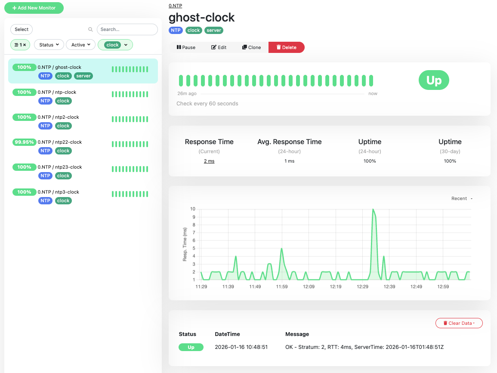

# uptime-kuma-mon

**uptime-kuma-mon** is a specialized fork of [Uptime Kuma](https://github.com/louislam/uptime-kuma), specifically enhanced with dedicated NTP monitoring capabilities.

---

## Key Feature: NTP Monitoring

The primary objective of this project is to provide integrated **NTP (Network Time Protocol)** checks, a feature not present in the standard version.

-   **NTP Server Health**: Monitor the responsiveness and synchronization status of your NTP servers.
-   **Future Roadmap**: We are committed to further expanding the NTP monitoring suite, focusing on enhancing features such as detailed status metrics and offset visualization.

## Screenshots

### NTP Monitoring Dashboard



## Features

This project is built upon the solid foundation of the original tool:

-   **Inheriting all the powerful features from the original Uptime Kuma.**

## Installation

You can deploy **uptime-kuma-mon** using Docker.

```bash
# Clone the repository
git clone [https://github.com/tanyorg/uptime-kuma-mon.git](https://github.com/tanyorg/uptime-kuma-mon.git)
cd uptime-kuma-mon

# Launch via Docker Compose
docker-compose up -d
```

## License

This project is licensed under the **MIT License**.  
See the [LICENSE](LICENSE) file for more details.

## Acknowledgments

-   **Original Project**: [Uptime Kuma](https://github.com/louislam/uptime-kuma) by louislam.
